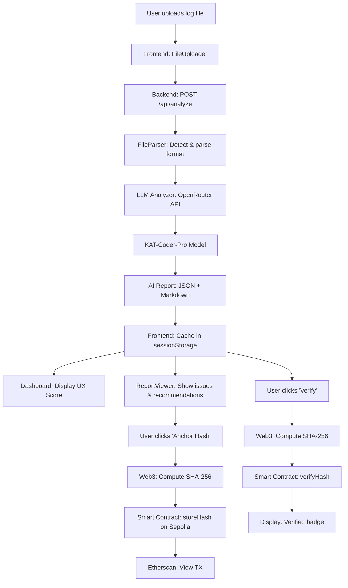

# Design Document - AutoUX

## Overview

AutoUX is a full-stack AI-powered UX analysis platform that leverages LLM technology and blockchain verification. The system consists of four main components:

1. **Frontend React (Vite)** - Modern UI with animations, gamification, and Web3 wallet integration
2. **Backend Node.js/Express** - API REST that processes multi-format logs via OpenRouter LLM
3. **LLM Analyzer (OpenRouter)** - KAT-Coder-Pro model for intelligent UX issue detection and recommendations
4. **Web3 Layer (Sepolia)** - Smart contract for on-chain hash anchoring and verification

The architecture prioritizes AI-driven analysis, cryptographic proof of integrity, modern UX design, and production-ready code quality.

## Architecture

```
autoux/
├── frontend/                      # React Application (Vite)
│   ├── src/
│   │   ├── components/           # React Components
│   │   │   ├── Dashboard.jsx     # Main dashboard with UX score gauge
│   │   │   ├── FileUploader.jsx  # Drag-drop file upload with animations
│   │   │   ├── ReportViewer.jsx  # AI report display with tabs
│   │   │   ├── Recommendations.jsx # Prioritized actions with WCAG/Web Vitals refs
│   │   │   ├── OnChainProof.jsx  # Web3 wallet connection & hash anchoring
│   │   │   ├── OnChainHistory.jsx # Past anchored reports from events
│   │   │   ├── NFTMinter.jsx     # ERC-721 badge minting
│   │   │   ├── QRCodeShare.jsx   # QR code generation for sharing
│   │   │   └── ErrorBoundary.jsx # Error handling
│   │   ├── services/
│   │   │   └── api.js            # Backend API client
│   │   ├── web3/
│   │   │   ├── hashUtils.js      # SHA-256 hashing utilities
│   │   │   ├── abiAutoUXRegistry.json # Smart contract ABI
│   │   │   ├── abiNFTBadge.json  # NFT contract ABI
│   │   │   └── ipfs.js           # IPFS upload utilities
│   │   ├── App.jsx               # Root component
│   │   └── main.jsx              # Entry point
│   ├── .env                      # Environment variables (API URLs, contract addresses)
│   ├── package.json
│   └── vite.config.js
├── backend/                       # Express Server
│   ├── src/
│   │   ├── config/
│   │   │   ├── paths.js          # File paths configuration
│   │   │   ├── server.js         # Server configuration
│   │   │   └── openrouter.js     # OpenRouter API configuration
│   │   ├── routes/
│   │   │   └── analyze.js        # POST /api/analyze endpoint
│   │   ├── services/
│   │   │   ├── fileParser.js     # Multi-format log parser
│   │   │   ├── llmAnalyzer.js    # OpenRouter LLM integration
│   │   │   └── reportGenerator.js # AI report formatting
│   │   ├── schemas/
│   │   │   └── index.js          # Zod validation schemas
│   │   └── server.js             # Entry point
│   ├── .env                      # Environment variables (OpenRouter API key)
│   └── package.json
├── web3/                          # Smart Contracts & Deployment
│   ├── contracts/
│   │   ├── AutoUXRegistry.sol    # Hash storage contract
│   │   └── UXBadgeNFT.sol        # ERC-721 NFT contract
│   ├── scripts/
│   │   ├── deploy.js             # Deployment script
│   │   └── verify.js             # Etherscan verification
│   ├── hardhat.config.js         # Hardhat configuration
│   ├── .env                      # Private key & RPC URL
│   └── package.json
├── package.json                   # Root workspace configuration
└── README.md                      # Complete documentation
```

### Data Flow



## Components and Interfaces

### Backend Components

#### 1. Server (backend/src/server.js)

Express server entry point with multipart file upload support.

**Responsibilities:**
- Initialize Express with CORS, JSON middleware, and multer for file uploads
- Mount API routes
- Start server on port 3001
- Global error handling with structured responses

**Configuration:**
```javascript
// backend/src/config/server.js
{
  port: 3001,
  cors: { 
    origin: "http://localhost:5173",
    credentials: true 
  },
  headers: {
    "X-Content-Type-Options": "nosniff",
    "X-Frame-Options": "DENY"
  },
  upload: {
    maxFileSize: 10 * 1024 * 1024, // 10MB
    allowedMimeTypes: [
      "application/json",
      "text/plain",
      "text/csv",
      "application/xml",
      "text/xml",
      "text/html",
      "application/har+json"
    ]
  }
}

// backend/src/config/openrouter.js
{
  apiKey: process.env.OPENROUTER_API_KEY,
  model: "kwaipilot/kat-coder-pro:free",
  baseURL: "https://openrouter.ai/api/v1",
  timeout: 60000 // 60s
}
```

#### 2. Analyze Router (backend/src/routes/analyze.js)

Handles log file upload and AI analysis.

**Endpoints:**

- `POST /api/analyze`
  - Description: Upload log file and receive AI-generated UX analysis
  - Content-Type: multipart/form-data
  - Body: `{ file: File }`
  - Response: `{ report: AIReport, markdown: string }`
  - Status: 200 OK, 400 Bad Request, 500 Internal Server Error
  - Validation: File size < 10MB, supported formats only

**Flow:**
1. Receive file upload via multer
2. Detect file format (JSON, NDJSON, CSV, XML, HTML, HAR, TXT, LOG)
3. Parse file content using appropriate parser
4. Send parsed data to LLM Analyzer
5. Return structured AI Report + Markdown

#### 3. File Parser Service (backend/src/services/fileParser.js)

Multi-format log file parser with automatic format detection.

**Methods:**
- `detectFormat(buffer: Buffer, filename: string): string` - Detect file format from content and extension
- `parseJSON(content: string): Array<LogEntry>` - Parse standard JSON arrays
- `parseNDJSON(content: string): Array<LogEntry>` - Parse newline-delimited JSON
- `parseCSV(content: string): Array<LogEntry>` - Parse CSV with header detection
- `parseXML(content: string): Array<LogEntry>` - Parse XML log structures
- `parseHTML(content: string): Array<LogEntry>` - Extract log data from HTML tables
- `parseHAR(content: string): Array<LogEntry>` - Parse HTTP Archive format
- `parsePlainText(content: string): Array<LogEntry>` - Parse unstructured text logs
- `parse(buffer: Buffer, filename: string): Array<LogEntry>` - Main entry point

**Implementation Strategy:**
```javascript
export const parse = (buffer, filename) => {
  const format = detectFormat(buffer, filename);
  const content = buffer.toString('utf-8');
  
  switch(format) {
    case 'json': return parseJSON(content);
    case 'ndjson': return parseNDJSON(content);
    case 'csv': return parseCSV(content);
    case 'xml': return parseXML(content);
    case 'html': return parseHTML(content);
    case 'har': return parseHAR(content);
    default: return parsePlainText(content);
  }
};
```

#### 4. LLM Analyzer Service (backend/src/services/llmAnalyzer.js)

OpenRouter integration for AI-powered UX analysis.

**Methods:**
- `analyzeWithLLM(logs: Array<LogEntry>): Promise<AIReport>` - Send logs to LLM and get structured analysis
- `buildPrompt(logs: Array<LogEntry>): string` - Construct analysis prompt with instructions
- `parseResponse(response: string): AIReport` - Parse LLM response into structured format

**Implementation:**
```javascript
import OpenAI from "openai";
import { OPENROUTER_CONFIG } from "../config/openrouter.js";

const client = new OpenAI({
  baseURL: OPENROUTER_CONFIG.baseURL,
  apiKey: OPENROUTER_CONFIG.apiKey,
});

export const analyzeWithLLM = async (logs) => {
  const prompt = buildPrompt(logs);
  
  const completion = await client.chat.completions.create({
    model: OPENROUTER_CONFIG.model,
    messages: [
      {
        role: "system",
        content: "You are an expert UX analyzer. Analyze logs and provide structured JSON output with issues, categories, severities, recommendations, and a UX score (0-100)."
      },
      {
        role: "user",
        content: prompt
      }
    ],
    response_format: { type: "json_object" },
    temperature: 0.3,
  });
  
  return parseResponse(completion.choices[0].message.content);
};
```

**Prompt Structure:**
- System context: UX analysis expert role
- Log data: Formatted log entries
- Instructions: Detect latency (>3000ms), accessibility (WCAG), contrast (<4.5:1), JS errors
- Output format: JSON with issues[], categories, recommendations with WCAG/Web Vitals references, UX score
- Standards: WCAG 2.2 (1.4.3, 1.1.1, 2.1.1, 4.1.2), Web Vitals (LCP, FID, CLS)

#### 5. Report Generator Service (backend/src/services/reportGenerator.js)

Formats AI analysis into structured report with Markdown output.

**Methods:**
- `generateReport(aiResponse: AIReport): { report: AIReport, markdown: string }` - Create final report
- `generateMarkdown(report: AIReport): string` - Convert report to Markdown format
- `addMetadata(report: AIReport): AIReport` - Add timestamps, IDs, version info

**Markdown Template:**
```markdown
# AutoUX Analysis Report

**Generated:** {timestamp}
**UX Score:** {score}/100 {emoji}

## Summary
- Total Issues: {count}
- Critical: {critical} | High: {high} | Medium: {medium} | Low: {low}

## Issues by Category
{categories with issue lists}

## Recommendations
{prioritized actions with WCAG/Web Vitals references}

## Standards References
- WCAG 2.2: {relevant criteria}
- Web Vitals: {relevant metrics}
```

**Schema Validation (backend/src/schemas/index.js):**
```javascript
import { z } from "zod";

export const AIReportSchema = z.object({
  id: z.string(),
  timestamp: z.string(),
  uxScore: z.number().min(0).max(100),
  issues: z.array(z.object({
    id: z.string(),
    type: z.enum(["latency", "accessibility", "contrast", "javascript_error", "other"]),
    severity: z.enum(["critical", "high", "medium", "low"]),
    description: z.string(),
    category: z.string(),
    metadata: z.record(z.any()),
  })),
  categories: z.record(z.number()),
  recommendations: z.array(z.object({
    priority: z.number(),
    title: z.string(),
    description: z.string(),
    why: z.string(),
    references: z.array(z.string()),
  })),
});
```

### Web3 Components

#### 6. Smart Contract (web3/contracts/AutoUXRegistry.sol)

Solidity contract for on-chain hash storage and verification on Sepolia testnet.

**Contract Structure:**
```solidity
// SPDX-License-Identifier: MIT
pragma solidity ^0.8.20;

contract AutoUXRegistry {
    struct Record {
        bytes32 contentHash;
        address uploader;
        uint64 timestamp;
    }
    
    mapping(string => Record) private records;
    
    event HashStored(string indexed reportId, bytes32 contentHash, address indexed uploader, uint64 timestamp);
    
    function storeHash(string memory reportId, bytes32 contentHash) external {
        require(contentHash != bytes32(0), "Invalid hash");
        records[reportId] = Record(contentHash, msg.sender, uint64(block.timestamp));
        emit HashStored(reportId, contentHash, msg.sender, uint64(block.timestamp));
    }
    
    function verifyHash(string memory reportId, bytes32 contentHash) external view returns (bool) {
        return records[reportId].contentHash == contentHash;
    }
    
    function getRecord(string memory reportId) external view returns (bytes32, address, uint64) {
        Record memory record = records[reportId];
        return (record.contentHash, record.uploader, record.timestamp);
    }
}
```

**Deployment Configuration (web3/hardhat.config.js):**
```javascript
require("@nomicfoundation/hardhat-toolbox");
require("dotenv").config();

module.exports = {
  solidity: "0.8.20",
  networks: {
    sepolia: {
      url: process.env.ALCHEMY_SEPOLIA_RPC,
      accounts: [process.env.PRIVATE_KEY],
      chainId: 11155111
    }
  },
  etherscan: {
    apiKey: process.env.ETHERSCAN_API_KEY
  }
};
```

### Frontend Components

#### 1. App Component (frontend/src/App.jsx)

Root application component with state management and routing.

**State:**
```javascript
{
  report: AIReport | null,
  markdown: string | null,
  loading: boolean,
  error: string | null,
  uploadProgress: number
}
```

**Responsibilities:**
- Manage global application state
- Handle file upload and API communication
- Cache reports in sessionStorage
- Coordinate between child components
- Display header with animated gradient and AI-powered indicator
- Show footer with technologies, features, GitHub link, and hackathon badge

**Layout:**
```jsx
<App>
  <Header animated gradient with "AI-Powered" pulse indicator />
  {!report && <FileUploader onUpload={handleUpload} />}
  {loading && <LoadingSpinner />}
  {report && (
    <>
      <Dashboard report={report} />
      <OnChainProof report={report} />
      <ReportViewer report={report} markdown={markdown} />
      <Recommendations recommendations={report.recommendations} />
      <OnChainHistory userAddress={connectedAddress} />
    </>
  )}
  <Footer with Web3 info, tech stack, GitHub link />
</App>
```

#### 2. Dashboard Component (frontend/src/components/Dashboard.jsx)

Main dashboard with UX score visualization and summary.

**Props:**
```javascript
{
  report: AIReport
}
```

**Features:**
- Animated circular UX Score gauge (0-100) with color grading:
  - 90-100: Green (#10b981) - "Excellent" 🟢
  - 70-89: Amber (#f59e0b) - "Fair" 🟠
  - <70: Red (#ef4444) - "Critical" 🔴
- Summary cards showing total issues, breakdown by severity
- Category distribution with icons
- AI personality message: "🧠 AutoUX scanned your logs – I found X critical UX issues you should fix first."
- Shareable badge: "🏅 My App scored X/100 on AutoUX AI" with share button
- Quick filters: severity, type, timestamp
- Compact mode toggle for dense vs card view

**Animation:**
```javascript
// Gauge animation using CSS/Framer Motion
const gaugeVariants = {
  initial: { strokeDashoffset: 283 },
  animate: { 
    strokeDashoffset: 283 - (283 * score / 100),
    transition: { duration: 1.5, ease: "easeOut" }
  }
};
```

#### 3. FileUploader Component (frontend/src/components/FileUploader.jsx)

Drag-and-drop file upload with animations and format support.

**Props:**
```javascript
{
  onUpload: (file: File) => Promise<void>,
  loading: boolean
}
```

**Features:**
- Drag-and-drop zone with hover animations (dashed → solid blue border + glow effect)
- Click to browse file picker
- Supported formats badge: JSON, NDJSON, CSV, XML, HTML, HAR, TXT, LOG
- File size validation (max 10MB)
- Upload progress bar with percentage
- Debounced upload to prevent multiple simultaneous uploads
- Empty state with 3D-style illustration and engaging CTA
- Responsive: full-width (90vw) on mobile

**Animations:**
```css
.drop-zone:hover {
  border: 2px solid #2563eb;
  box-shadow: 0 0 20px rgba(37, 99, 235, 0.3);
  transform: scale(1.02);
  transition: all 0.3s ease;
}
```

#### 4. OnChainProof Component (frontend/src/components/OnChainProof.jsx)

Web3 wallet connection and hash anchoring interface.

**Props:**
```javascript
{
  report: AIReport,
  reportId: string
}
```

**State:**
```javascript
{
  account: string | null,
  status: string,
  verified: boolean | null,
  txHash: string | null,
  loading: boolean
}
```

**Features:**
- Purple gradient background card with "Privacy-first" message
- Connect Wallet button (MetaMask detection)
- Display connected address (abbreviated: 0x1234...5678)
- Large "Anchor Hash" button - computes SHA-256 and calls contract.storeHash()
- Large "Verify" button - computes SHA-256 and calls contract.verifyHash()
- Status badges:
  - 🟢 "Connected" when wallet connected
  - 🟡 "Anchoring..." during transaction
  - ✅ "Verified on-chain" when hash matches
  - ⚠️ "Not yet anchored" when no record found
  - ❌ "Verification failed" when hash mismatch
- Toast notifications for all Web3 actions
- Loading states for pending transactions
- Retry logic for failed transactions
- "View on Etherscan" link with tooltip
- Note: "Only the SHA-256 hash of the AI report is stored on-chain. Logs remain local and private."

**Web3 Integration:**
```javascript
import { ethers } from "ethers";
import { sha256HexFromObject } from "../web3/hashUtils";
import ABI from "../web3/abiAutoUXRegistry.json";

const anchorHash = async () => {
  const provider = new ethers.BrowserProvider(window.ethereum);
  const signer = await provider.getSigner();
  const contract = new ethers.Contract(REGISTRY_ADDRESS, ABI, signer);
  
  const hash = sha256HexFromObject(report);
  const tx = await contract.storeHash(reportId, hash);
  await tx.wait();
  
  setStatus("✅ Hash stored on-chain");
  setTxHash(tx.hash);
};
```

#### 5. Recommendations Component (frontend/src/components/Recommendations.jsx)

Displays prioritized recommendations with standards references.

**Props:**
```javascript
{
  recommendations: Array<Recommendation>
}
```

**Features:**
- "AutoUX Recommends" header with AI icon
- Prioritized list (1, 2, 3...) with visual hierarchy
- Each recommendation shows:
  - Title and description
  - "Why this matters" explanation
  - WCAG 2.2 references (clickable links to spec)
  - Web Vitals references (clickable links to web.dev)
- Tab switcher: Markdown view / JSON view
- Collapsible sections for each recommendation
- Copy button for code examples
- Keyboard navigation support

**WCAG References:**
```javascript
const WCAG_LINKS = {
  "1.4.3": "https://www.w3.org/WAI/WCAG22/Understanding/contrast-minimum",
  "1.1.1": "https://www.w3.org/WAI/WCAG22/Understanding/non-text-content",
  "2.1.1": "https://www.w3.org/WAI/WCAG22/Understanding/keyboard",
  "4.1.2": "https://www.w3.org/WAI/WCAG22/Understanding/name-role-value"
};

const WEB_VITALS_LINKS = {
  "LCP": "https://web.dev/lcp/",
  "FID": "https://web.dev/fid/",
  "CLS": "https://web.dev/cls/"
};
```

#### 6. OnChainHistory Component (frontend/src/components/OnChainHistory.jsx)

Displays user's past on-chain anchored reports.

**Props:**
```javascript
{
  userAddress: string | null
}
```

**Features:**
- Section title: "Your On-Chain Anchors"
- Fetch past HashStored events from Sepolia filtered by user address
- Display table/cards with:
  - Report ID
  - UX Score (if available in cached data)
  - Hash (abbreviated)
  - Date & Time
  - Transaction link to Etherscan
- Empty state: "No anchored reports yet. Anchor your first report above!"
- Pagination if > 10 records
- Refresh button to fetch latest events

**Event Fetching:**
```javascript
const fetchHistory = async () => {
  const provider = new ethers.JsonRpcProvider(ALCHEMY_SEPOLIA_RPC);
  const contract = new ethers.Contract(REGISTRY_ADDRESS, ABI, provider);
  
  const filter = contract.filters.HashStored(null, null, userAddress);
  const events = await contract.queryFilter(filter, -10000); // Last ~10k blocks
  
  return events.map(event => ({
    reportId: event.args.reportId,
    hash: event.args.contentHash,
    timestamp: event.args.timestamp,
    txHash: event.transactionHash
  }));
};
```

#### 7. Additional Components

**NFTMinter.jsx** - ERC-721 badge minting with IPFS metadata
**QRCodeShare.jsx** - QR code generation for sharing verification proofs
**ReportViewer.jsx** - Main report display with issues list and filtering
**ErrorBoundary.jsx** - React error boundary with fallback UI

## Data Models

### AIReport

```typescript
interface AIReport {
  id: string;
  timestamp: string;
  uxScore: number; // 0-100
  issues: Array<Issue>;
  categories: Record<string, number>; // category name -> count
  recommendations: Array<Recommendation>;
  metadata: {
    totalIssues: number;
    criticalCount: number;
    highCount: number;
    mediumCount: number;
    lowCount: number;
    analysisModel: string; // "kwaipilot/kat-coder-pro:free"
  };
}
```

### Issue

```typescript
interface Issue {
  id: string;
  type: "latency" | "accessibility" | "contrast" | "javascript_error" | "other";
  severity: "critical" | "high" | "medium" | "low";
  description: string;
  category: string;
  metadata: {
    responseTime?: number;
    element?: string;
    errorMessage?: string;
    stackTrace?: string;
    contrastRatio?: number;
    wcagCriteria?: string[];
    webVitalsMetric?: string;
    [key: string]: any;
  };
}
```

### Recommendation

```typescript
interface Recommendation {
  priority: number; // 1, 2, 3...
  title: string;
  description: string;
  why: string; // Explanation of impact
  references: Array<string>; // WCAG/Web Vitals links
  codeExample?: string;
  estimatedImpact: "high" | "medium" | "low";
}
```

### API Response Formats

**POST /api/analyze Response:**
```json
{
  "report": {
    "id": "report-abc123",
    "timestamp": "2025-11-13T10:30:00Z",
    "uxScore": 72,
    "issues": [
      {
        "id": "issue-001",
        "type": "latency",
        "severity": "high",
        "description": "API response time exceeds 5000ms",
        "category": "Performance",
        "metadata": {
          "responseTime": 5200,
          "endpoint": "/api/users",
          "webVitalsMetric": "LCP"
        }
      },
      {
        "id": "issue-002",
        "type": "accessibility",
        "severity": "critical",
        "description": "Image missing alt text",
        "category": "Accessibility",
        "metadata": {
          "element": "",
          "wcagCriteria": ["1.1.1"]
        }
      }
    ],
    "categories": {
      "Performance": 3,
      "Accessibility": 5,
      "JavaScript Errors": 1
    },
    "recommendations": [
      {
        "priority": 1,
        "title": "Optimize API Response Times",
        "description": "Reduce server response time to under 2.5s for better LCP",
        "why": "Slow API responses directly impact Largest Contentful Paint (LCP), a core Web Vital that affects user experience and SEO rankings.",
        "references": [
          "https://web.dev/lcp/",
          "https://web.dev/optimize-lcp/"
        ],
        "estimatedImpact": "high"
      }
    ],
    "metadata": {
      "totalIssues": 9,
      "criticalCount": 2,
      "highCount": 3,
      "mediumCount": 3,
      "lowCount": 1,
      "analysisModel": "kwaipilot/kat-coder-pro:free"
    }
  },
  "markdown": "# AutoUX Analysis Report\n\n**Generated:** 2025-11-13T10:30:00Z..."
}
```

## Error Handling

### Backend Error Handling

**Strategy:**
1. Try-catch in all route handlers
2. Global Express error middleware
3. Structured error logging with timestamps
4. User-friendly error responses (no sensitive data exposure)

**Error Response Format:**
```json
{
  "error": {
    "message": "User-friendly error description",
    "code": "ERROR_CODE",
    "timestamp": "2025-11-13T10:30:00Z"
  }
}
```

**Error Codes:**
- `FILE_TOO_LARGE`: Uploaded file exceeds 10MB limit
- `UNSUPPORTED_FORMAT`: File format not supported
- `PARSE_ERROR`: Failed to parse log file
- `LLM_API_ERROR`: OpenRouter API request failed
- `LLM_TIMEOUT`: LLM analysis exceeded 60s timeout
- `INVALID_RESPONSE`: LLM returned invalid JSON
- `RATE_LIMIT_EXCEEDED`: Too many requests to OpenRouter

**LLM Error Handling:**
```javascript
try {
  const completion = await client.chat.completions.create({...});
  return parseResponse(completion.choices[0].message.content);
} catch (error) {
  if (error.status === 429) {
    throw new Error("RATE_LIMIT_EXCEEDED");
  } else if (error.code === 'ETIMEDOUT') {
    throw new Error("LLM_TIMEOUT");
  } else {
    console.error("LLM API Error:", error);
    throw new Error("LLM_API_ERROR");
  }
}
```

### Frontend Error Handling

**Strategy:**
1. Try-catch in all async operations
2. Error state management in components
3. Toast notifications for transient errors
4. Modal dialogs for critical errors
5. Retry logic with exponential backoff
6. Error boundary for React render errors

**Web3 Error Handling:**
```javascript
const handleWeb3Error = (error) => {
  if (!window.ethereum) {
    return "MetaMask not found. Please install MetaMask to use Web3 features.";
  } else if (error.code === 4001) {
    return "Transaction rejected by user.";
  } else if (error.code === -32603) {
    return "Insufficient funds for gas. Get testnet ETH from faucet.";
  } else if (error.message.includes("network")) {
    return "Network error. Please check your connection to Sepolia testnet.";
  } else {
    return "Transaction failed. Please try again.";
  }
};
```

**UX States:**
- Loading: Animated spinner with progress indicator
- Empty: Modern empty state with engaging CTA
- Error: User-friendly message with retry button and support link
- Success: Toast notification with checkmark animation

## Testing Strategy

### Backend Testing

**Unit Tests (Jest):**
- File Parser: Test each format parser (JSON, NDJSON, CSV, XML, HTML, HAR, TXT, LOG)
- LLM Analyzer: Mock OpenRouter API responses, test prompt building
- Report Generator: Test Markdown generation, metadata addition
- Schema Validation: Test Zod schemas with valid/invalid data
- Routes: Test HTTP responses (200, 400, 500), file upload validation

**Integration Tests:**
- End-to-end flow: Upload file → Parse → LLM analysis → Return report
- Error scenarios: Invalid file format, LLM timeout, API errors
- File size limits: Test 10MB boundary
- Rate limiting: Test OpenRouter rate limit handling

**Test Files:**
- `backend/src/services/__tests__/fileParser.test.js`
- `backend/src/services/__tests__/llmAnalyzer.test.js`
- `backend/src/services/__tests__/reportGenerator.test.js`
- `backend/src/schemas/__tests__/validation.test.js`
- `backend/src/routes/__tests__/analyze.test.js`

### Frontend Testing

**Component Tests (Vitest + React Testing Library):**
- Dashboard: UX score gauge animation, color grading, summary cards
- FileUploader: Drag-drop, file validation, progress indicator
- OnChainProof: Wallet connection, hash anchoring, verification
- Recommendations: Tab switching, WCAG/Web Vitals links
- OnChainHistory: Event fetching, table display, pagination

**Accessibility Tests:**
- Automated testing with axe-core/jest-axe
- Keyboard navigation for all interactive elements
- ARIA labels on all buttons and status indicators
- Color contrast validation (AA standard minimum)
- Screen reader compatibility

**Web3 Tests:**
- Mock ethers.js provider and signer
- Test wallet connection flow
- Test hash computation (SHA-256)
- Test contract interaction (storeHash, verifyHash)
- Test error handling (no MetaMask, rejected TX, insufficient gas)

**Test Files:**
- `frontend/src/components/__tests__/Dashboard.test.jsx`
- `frontend/src/components/__tests__/FileUploader.test.jsx`
- `frontend/src/components/__tests__/OnChainProof.test.jsx`
- `frontend/src/components/__tests__/Recommendations.test.jsx`
- `frontend/src/web3/__tests__/hashUtils.test.js`

### Smart Contract Testing

**Hardhat Tests:**
- Test storeHash function with valid/invalid hashes
- Test verifyHash function with matching/non-matching hashes
- Test getRecord function
- Test event emission (HashStored)
- Test access control and edge cases

**Test File:**
- `web3/test/AutoUXRegistry.test.js`

### E2E Testing Scenarios

**Manual Testing Checklist:**
1. Upload various log formats → Verify AI analysis
2. View dashboard → Check UX score gauge animation
3. Connect MetaMask → Verify wallet connection
4. Anchor hash → Verify transaction on Sepolia Etherscan
5. Verify hash → Check "Verified on-chain" badge
6. View on-chain history → Check past anchored reports
7. Mobile responsive → Test on various screen sizes
8. Accessibility → Test with keyboard only, screen reader

## Implementation Notes

### Performance Optimizations

**Backend:**
- Stream large file uploads instead of loading into memory
- Implement request rate limiting to prevent OpenRouter API abuse
- Cache LLM responses with TTL (Time To Live) for identical log files
- Use compression middleware (gzip) for API responses
- Implement connection pooling for database if persistence is added

**Frontend:**
- React.lazy() and Suspense for code splitting
- sessionStorage caching for AI reports (avoid redundant API calls)
- Debounced file upload (300ms) to prevent multiple simultaneous uploads
- Virtual scrolling for large issue lists (>100 items)
- Image optimization and lazy loading
- Service Worker for offline capability (future enhancement)

**Web3:**
- Batch event queries to reduce RPC calls
- Cache contract ABI and addresses
- Implement transaction queue for multiple anchoring operations
- Use ethers.js provider caching

### Security Considerations

**Backend:**
- File upload validation: size, MIME type, content inspection
- Rate limiting: 10 requests per minute per IP
- Input sanitization: Zod schema validation on all inputs
- CORS: Strict origin whitelist (localhost:5173 in dev, production domain in prod)
- Security headers: X-Content-Type-Options, X-Frame-Options, CSP
- No sensitive data in error messages
- OpenRouter API key stored in environment variables only
- No logging of user data or file contents

**Frontend:**
- XSS prevention: React's built-in escaping + DOMPurify for Markdown
- CSRF protection: SameSite cookies if authentication is added
- Content Security Policy headers
- No inline scripts or styles
- Validate all user inputs before display

**Web3:**
- Never send raw logs or reports on-chain (only SHA-256 hash)
- Validate bytes32 format before contract calls
- User confirmation before transactions
- Display gas estimates before sending
- Private key never exposed (MetaMask handles signing)
- Contract address validation (checksum)

### Extensibility Points

1. **Additional LLM Models**: Support multiple models (GPT-4, Claude, Gemini) with model selection UI
2. **Custom Analysis Rules**: Allow users to define custom UX rules via configuration
3. **Report Templates**: Multiple report formats (PDF, HTML, JSON, CSV export)
4. **Integrations**: GitHub Actions, CI/CD pipelines, Slack notifications
5. **Multi-chain Support**: Deploy contracts on Polygon, Arbitrum, Optimism
6. **IPFS Storage**: Store full reports on IPFS with on-chain CID reference
7. **Analytics Dashboard**: Track UX score trends over time
8. **Team Collaboration**: Multi-user support with role-based access
9. **API Keys**: Allow users to bring their own OpenRouter API keys
10. **Plugins**: Extensible architecture for custom analyzers and visualizations

## Root Package Configuration

The project uses npm workspaces to manage frontend, backend, and web3 modules.

**package.json (root):**
```json
{
  "name": "autoux",
  "version": "1.0.0",
  "private": true,
  "workspaces": ["frontend", "backend", "web3"],
  "scripts": {
    "install": "npm -ws install",
    "dev": "concurrently -n BACK,FRONT -c blue,green \"npm --prefix backend run dev\" \"npm --prefix frontend run dev\"",
    "start": "npm run dev",
    "test": "npm --prefix backend test && npm --prefix frontend test && npm --prefix web3 test",
    "test:backend": "npm --prefix backend test",
    "test:frontend": "npm --prefix frontend test",
    "test:web3": "npm --prefix web3 test",
    "deploy:contract": "npm --prefix web3 run deploy:sepolia",
    "verify:contract": "npm --prefix web3 run verify:sepolia"
  },
  "devDependencies": {
    "concurrently": "^9.0.0"
  }
}
```

**Environment Variables:**

`.env` files are used for configuration (never committed to git):

**backend/.env:**
```
OPENROUTER_API_KEY=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
PORT=3001
NODE_ENV=development
```

**frontend/.env:**
```
VITE_API_BASE_URL=http://localhost:3001/api
VITE_REGISTRY_ADDRESS=0x77b0...Afdf
VITE_NFT_ADDRESS=0x...
VITE_CHAIN_NAME=Sepolia
VITE_CHAIN_ID=11155111
VITE_ETHERSCAN_URL=https://sepolia.etherscan.io
VITE_ALCHEMY_SEPOLIA_RPC=https://eth-sepolia.g.alchemy.com/v2/7I6jhlKb8HeIDJ1aCAQ90
```

**web3/.env:**
```
PRIVATE_KEY=0x...
ALCHEMY_SEPOLIA_RPC=https://eth-sepolia.g.alchemy.com/v2/7I6jhlKb8HeIDJ1aCAQ90
ETHERSCAN_API_KEY=...
```

**Benefits:**
- Single command `npm run dev` to start everything
- Centralized dependency installation with `npm install`
- Unified testing with `npm test`
- Color-coded logs for backend/frontend
- Separate Web3 workspace for contract development
- Environment-based configuration for different deployment targets
